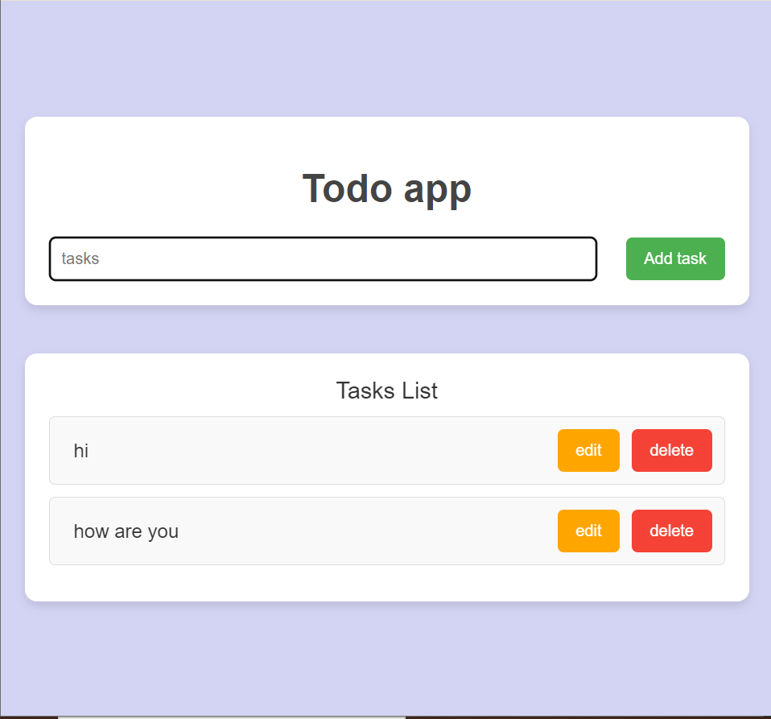

To-Do App

A simple, lightweight to-do app that allows users to add, edit, and delete tasks.

Features

Add Tasks: Users can add new tasks to the to-do list.

Edit Tasks: Users can edit the details of existing tasks.

Delete Tasks: Users can remove tasks from the to-do list.

Responsive Design: The app is designed to be mobile-friendly and works well on various devices.

Image of the app

Getting Started

To get started with the To-Do App, follow these steps:

Clone the repository:   git clone <url path of the repo>
Navigate to the project directory:   cd <projet name>  
compile the Typescript code using its compiler 
Open the index.html using the live server.

Technologies Used

HTML

CSS

TypeScript

Development

The To-Do App is built using TypeScript, which provides a strongly-typed programming language that can be compiled to JavaScript. The main functionality of the app is implemented in the index.ts file.

To modify the app, you can follow these steps:

Make the necessary changes to the TypeScript code in the index.ts file.

Compile the TypeScript code to JavaScript using a TypeScript compiler or a tool like Parcel or webpack.

Open the index.html file in your browser to see the updated app.